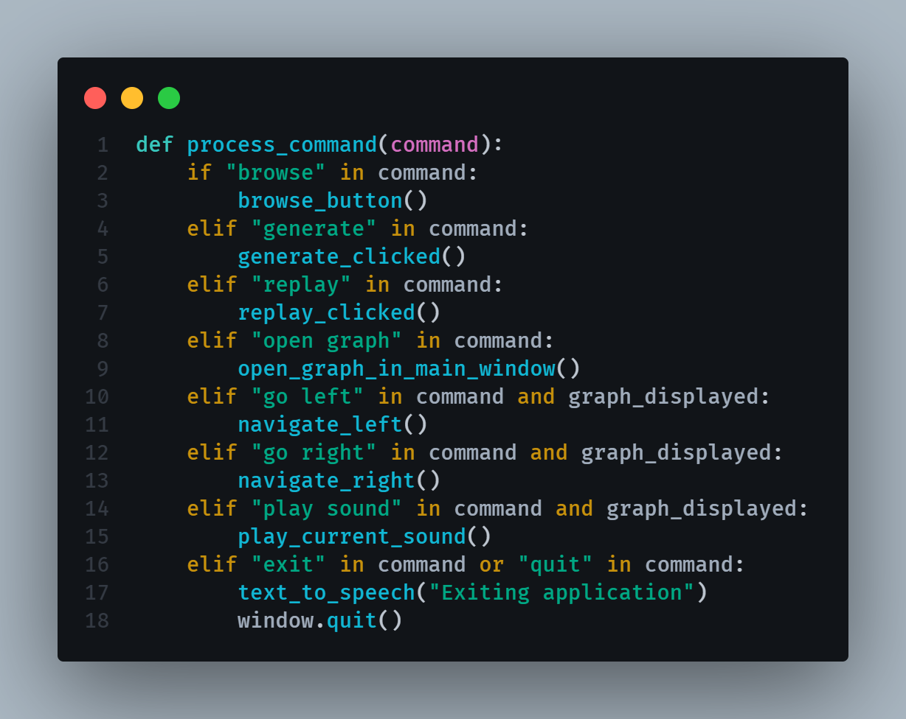

This program does a couple things:

1: The browse button can be used to find a datasheet. It only accepts CSV files exported from
the Capstone software. 

2: The Generate button will use the csv_parser.py script to convert the CSV file into one readable by VoltAudio.py.
It will then output a visible graph.

3: The Replay button will play the audio associated with the entire graph, and make another graph pop up...

4: The OpenGraph button will open up an in-window graph of the CSV file. This will allow you to use the LEFT and RIGHT ARROW keys to navigate through each point of the graph. Pressing the UP ARROW key will play the sound of the current point that your graph cursor is sitting on.

Things that should be better:
1: You can hold the SPACEBAR to speak to the program, and it will process your speech into a command.

These voice commands work sometimes, but the speech to text system is incredibly slow to the point where it isn't useable. This could be fixed with a more lightweight STT model, or a different voice recording solution.
2: Once you open the graph with (Open Graph), you have to restart the program to open a different graph.
3: A lot of these buttons generate useless graphs, and opening graphs in new windows isn't necessary since the addition of the (Open Graph) button.